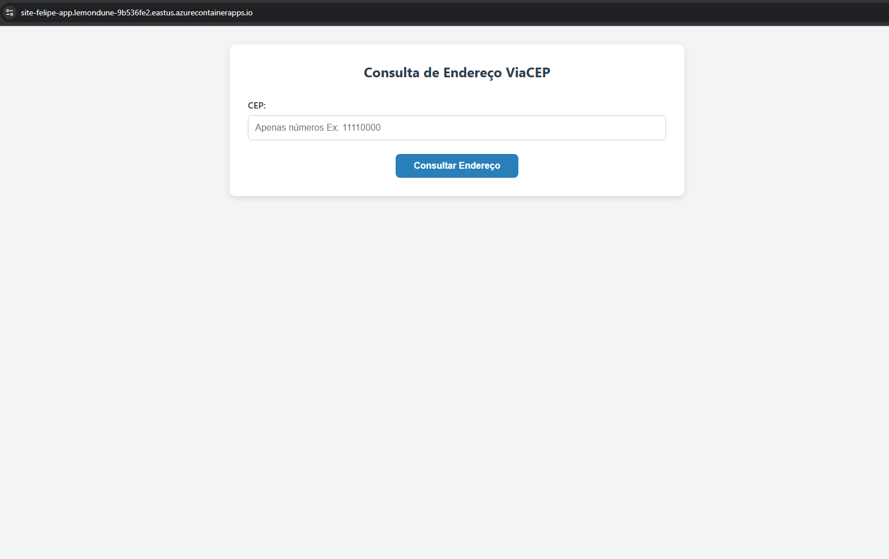

# 🌐 Deploy de Página HTML com Azure Container App

Este repositório contém um exemplo de aplicação web simples (HTML/CSS/JS) empacotada em um contêiner Docker e publicada na nuvem usando **Azure Container Apps**.

## 📦 Tecnologias Utilizadas

- HTML, CSS, JS
- Docker
- Azure CLI
- Azure Container Registry (ACR)
- Azure Container Apps

---

## 🚀 Como Criar 

```
# Crie e execute o container
docker build -t containerapp:latest .
docker run -d -p 80:80 containerapp:latest

# Faça Login no Azure
az login

# Crie um grupo de Recuros
az group create --name recoursegroup --location eastus

# Crie um ACR (Azure Container Registry)
az acr create --resource-group recoursegroup --name nomeacr --sku Basic

# Faça Login no ACR
az acr login --name nomeacr

# Adicione uma tag a imagem Docker para que seja possível o push
docker tag containerapp:latest nomeacr.azurecr.io/containerapp:latest

# Envie a imagem para o ACR através de push
docker push nomeacr.azurecr.io/containerapp:latest

#CONTAINERID = nomeacr.azurecr.io/containerapp:latest
#USER = nomeacr
#PASSWORD = <Sua senha gerada (Vá até chaves de acessos dentro do ACR no Azure)>

# Crie o ambiente para o Container App
az containerapp env create --name containerappenv --resource-group recoursegroup --location eastus 

# Crie o Container App
az containerapp create --name containerapp --resource-group recoursegroup --environment containerappenv --image siteacr.azurecr.io/containerapp:latest --target-port 80 --ingress external --registry-username nomeacr --registry-password <Sua Senha gerada> --registry-server <nomeacr.azurecr.io>

```

# Resultado

Exemplo de URL gerada:

`https://site-felipe-app.lemondune-9b536fe2.eastus.azurecontainerapps.io/`

## Imagem da página



